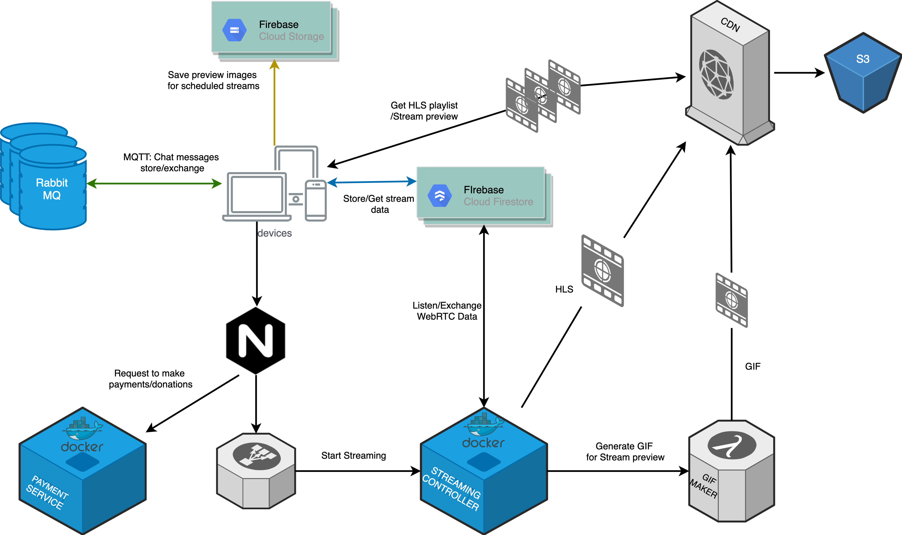

# Presentation for Hoomi Project 
## Used Techs
* Firebase Firestore (https://firebase.google.com/)
* RabbitMQ (https://www.rabbitmq.com/)
* Gstreamer (https://gstreamer.freedesktop.org/documentation/installing/index.html?gi-language=c)
* WebRTC (https://webrtc.org/)
* Stripe (https://stripe.com/)

## Architecture

## Project Description Video
Hoomi functionality (https://drive.google.com/file/d/1ApiReB4zCOtwuysFfSUMREwn2TSeT5x-/view?usp=sharing)
## Tech Description Video
Tech 1 (https://drive.google.com/file/d/19z6ggVE3hcgn5sVH0W99PbIIIukzifHB/view?usp=sharing)
Tech 2 (https://drive.google.com/file/d/18JPZJKzoc9E0jUDXcysBjS-UWZv87FfO/view?usp=sharing)
