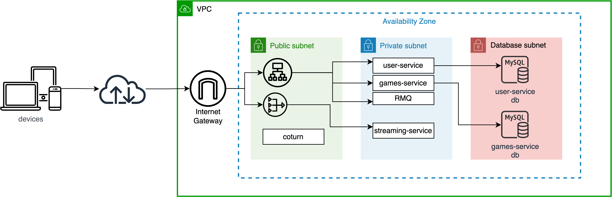
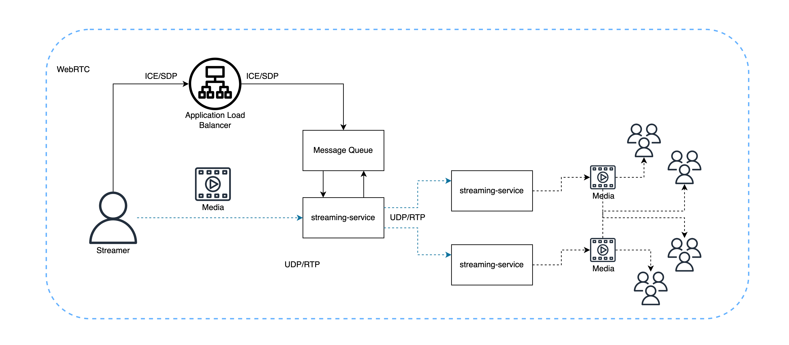
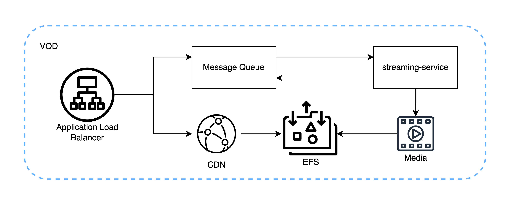
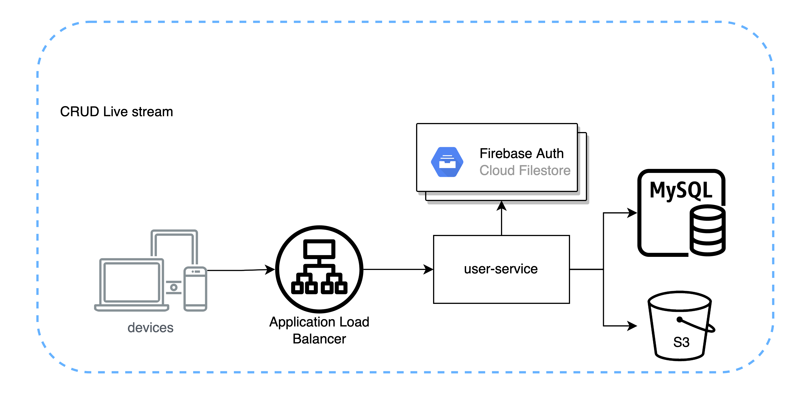
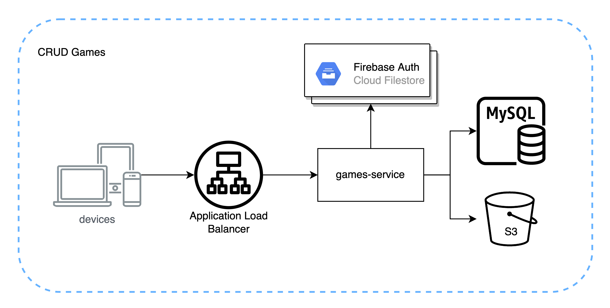

# Presentation for Hoomi Project (WIP)
## Project description
1. Hoomi это стриминговая платформа, позволяющая стримерам, влогерам,
ифлюенсерам и контент-студиям делиться своим творчеством в сети интнернет. 
Платформа позволяет юзерам делиться как платным контентом так и бесплатным. 
А также Hoomi может с легкостью интегриваться с наиболее популярными сервисами как youtube  и twitch. 
Это позволит нашим юзерам охватывать больше аудитории. 

2. Для стриминга Hoomi использует WebRTC стримы. 
В основе Hoomi лежит, свой собственный медиа сервер(hoomi-streaming-server/HSS), 
который позволяет обрабатывать медиа стримы(WebRTC/RTSP/RTMP).
HSS может быть использован как отдельный продукт. 
Платформа построена на микросервисной архитектуре и состоит из N серсисов (без учета автоскийлинга). 
В основном проект написан на Java с использованием всех современных тенденций и технологий. 
Как уже упоминалось ранее HSS обладает обширным функционалом, 
однако главной особенностью данного сервиса является то что, 
он способен транскодировать одни виды стримов в другие, s
peech to text/text to speech, осуществлять перевод в real time, 
а также может предоставлять контент как VOD так и WebRTC стримы.

3. Как работает Hoomi? Устройство захватывает аудио и видео стрим 
с камеры/экрана и отправляет сообщение в очередь о начале установки WebRTC соединения. 
HSS слушает очередь и начинает установку WebRTC соединения. 
После успешной установки соединения, 
WebRTC стрим транскодируется в HLS или подаётся как WebRTC стрим другим участникам, 
при желании добавляя субтитры/переведённые субтитры. 
Далее HLS/WebRTC стрим проигрывается на устройстве. 
Если юзер во время установки стрима, 
выбрал ретрансляцию стрима на другие популярные стриминговые платформы, 
то WebRTC стрим ещё и транскодируется на RTMP. 
И начинается вещание на другие сервисы. 
В зависимости от того какую задержу выбрал пользователь, 
можно устанавливать real time communication (webrtc) или как уже и указывалось выше отдавать VOD.

4. Функционал HSS: 
    * Устанавливать WebRTC соединение. 
    * Транскодировать WebRTC на RTSP/RTMP/HLS и наоборот. 
    * Производить запись стрима. 
    * Отправлять стрим по  UDP/RTP.  
    * Осуществлять text-to-speech/translate и добавлять это в стрим
    * Собирать из стрима GIF а также извлекать картинки в формате PNG/JPEG.  
HSS поддерживает все популярные кодеки: H264/265, VP8/9, Opus, PCMU, G711. 
Как ядро HSS использует GStreamer. 

5. В рамках проекта создаётся удобная площадка для коммуникации стримерского сообщеста
(для геймеров, артистов, влогеров). 
Упрощенный способ донатов и способ заработка.
Возможность осуществлять платные трансляции и составлять платный плэйлист из видео. 
Возможность ретранслировать стримы на другие популярные площадки. 
А также приложением предусмотрена система голосований (left/right). 
Во время стрима, стример, может создать голосование, в котором будет только 2 выбора. 
И пользователи могут проголосовать. 
Голосование может быть как платным так и бесплатным.\
Пример:\

| В каком образе мне пойти на вечеринку? |
| -------------------------------------- |
| <table> <tr> <th style="background-color: blue"> Супермэн </th>  <th style="background-color: red"> Бэтмен </th> </tr> <tr> <td> 2$ </td>  <td> 5$ </td> </tr> </table> |

## Used Techs
* Firebase Firestore (https://firebase.google.com/)
* RabbitMQ (https://www.rabbitmq.com/)
* MQTT (https://www.rabbitmq.com/mqtt.html#tls)
* Gstreamer (https://gstreamer.freedesktop.org/documentation/installing/index.html?gi-language=c)
* WebRTC (https://webrtc.org/)
* HLS (https://developer.apple.com/streaming/)
* Stripe (https://stripe.com/)
* Cloud AWS (https://aws.amazon.com)
* Database MYSQL(https://www.mysql.com/)

## Architecture
### AWS

### WebRTC delivery

### VOD delivery

### CRUD Live Streams

### CRUD Games

## Project Description Video
Hoomi functionality (https://drive.google.com/file/d/1ApiReB4zCOtwuysFfSUMREwn2TSeT5x-/view?usp=sharing)
## Tech Description Video
Tech 1 (https://drive.google.com/file/d/19z6ggVE3hcgn5sVH0W99PbIIIukzifHB/view?usp=sharing)
Tech 2 (https://drive.google.com/file/d/18JPZJKzoc9E0jUDXcysBjS-UWZv87FfO/view?usp=sharing)
